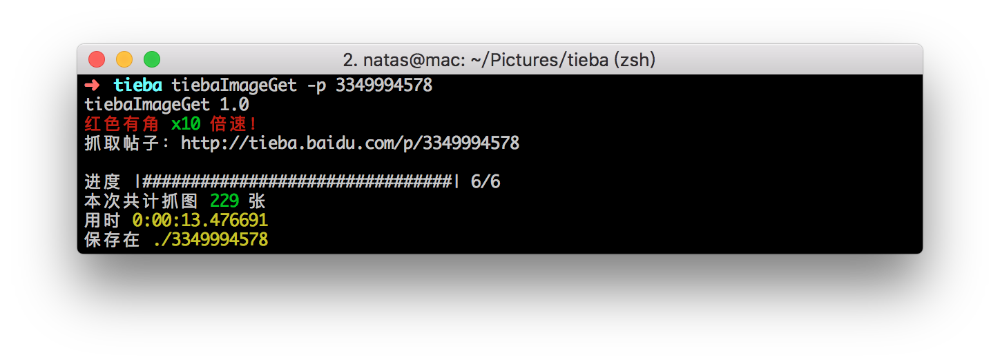
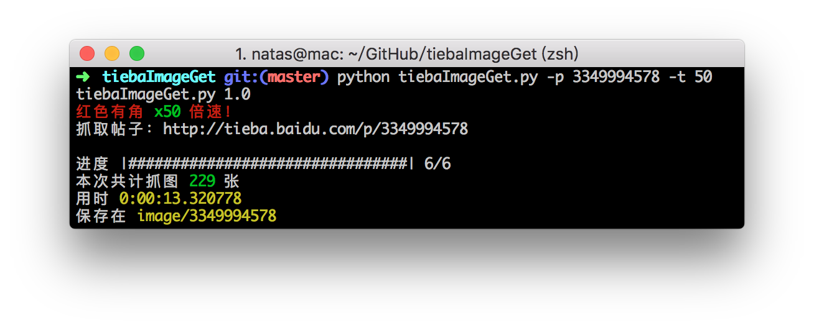
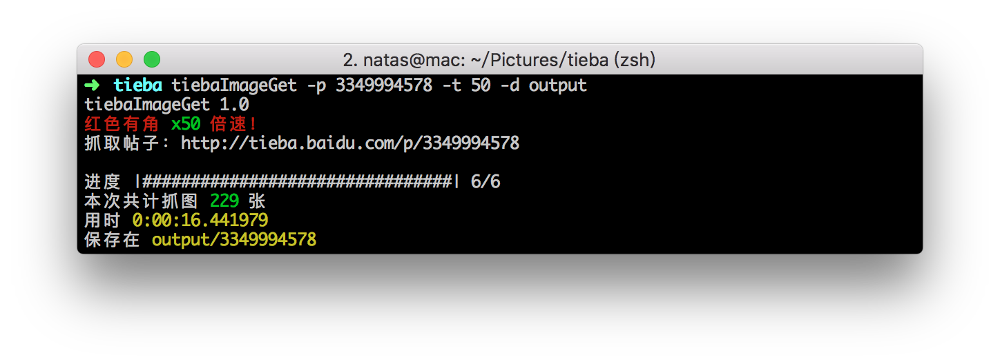

tiebaImageGet
=============

贴吧图楼爬图器
### 安装

	git clone https://github.com/zhaohui8969/tiebaImageGet
	cd tiebaImageGet
	python setup.py install
	
### 用法
- 下载帖子中的所有图片

	`tiebaImageGet -p 3349994578`

- 开多个线程下载帖子中的图片

	`tiebaImageGet -p 3349994578 -t 50`
	
- 下载图片到指定目录

	`tiebaImageGet -p 3349994578 -t 50 -d output`
	
`-p PID`	帖子ID（比如http://tieba.baidu.com/p/3349994578，就是3349994578）

`-t MAX_THREAD_NUM`	图片下载线程数

`-d SAVE_DIRECTORY` 下载目录（默认是当前目录，目录不存在的话会自动创建）

### License
GPLv2